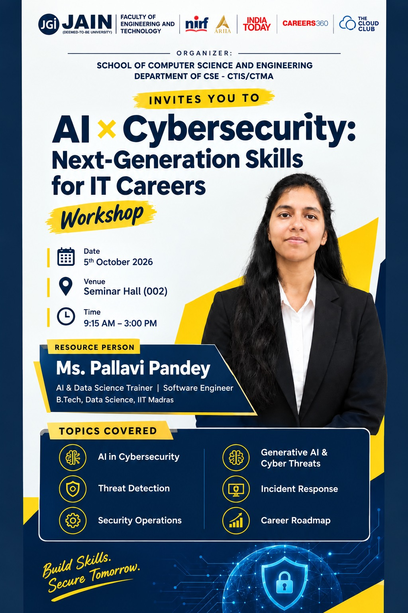

# AI × Cybersecurity: Next-Generation Skills for IT Careers

Industry-focused workshop for students at Jain (Deemed-to-be University), Faculty of Engineering and Technology.

## Details

| | |
|---|---|
| **Date** | 5th October 2026 |
| **Time** | 9:15 AM – 3:00 PM |
| **Venue** | Seminar Hall (002) |
| **Organizer** | School of Computer Science and Engineering, Department of CSE – CTIS/CTMA |
| **Resource person** | Ms. Pallavi Pandey, AI & Data Science Trainer | Software Engineer, B.Tech Data Science, IIT Madras |

## Topics

1. [AI in Cybersecurity](sessions/01-ai-in-cybersecurity.md)
2. [Generative AI & Cyber Threats](sessions/02-generative-ai-and-cyber-threats.md)
3. [Threat Detection](sessions/03-threat-detection.md)
4. [Incident Response](sessions/04-incident-response.md)
5. [Security Operations](sessions/05-security-operations.md)
6. [Career Roadmap](sessions/06-career-roadmap.md)

> Build Skills. Secure Tomorrow.
